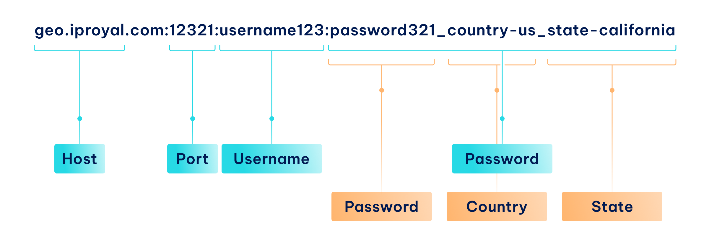

# Proxy

In this section, we will delve into the creation and configuration of a proxy string. We'll cover how to target specific locations, apply rotation settings, select the appropriate protocol, and more. Additionally, we will demonstrate how to make a request using a proxy.

To begin, it's important to understand that a proxy string comprises four elements: **host**, **port**, **username**, and **password**. While there are multiple methods to combine these four elements, for the sake of simplicity, we will adopt the format: **HOST:PORT:USERNAME:PASSWORD**.

Residential proxies utilize the **password** segment of the string to configure the aforementioned settings. For instance, consider the following proxy string designed to target the state of California in the USA:

<figure><figcaption></figcaption></figure>

As mentioned earlier, the string has four main sections (highlighted in blue), and the last one is labeled 'Password.' This section holds all the configuration details for the proxy.

### Proxy Regions

We offer multiple proxy regions:

* `proxy.iproyal.com` - Germany region
* `us.proxy.iproyal.com` - US region
* `sg.proxy.iproyal.com` - Singapore region

For automatic region selection, use `geo.iproyal.com` - it will automatically connect you to the most optimal region based on your request IP location.
