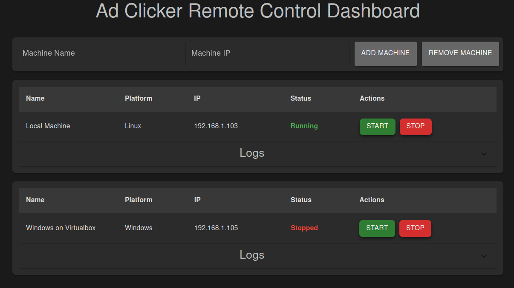
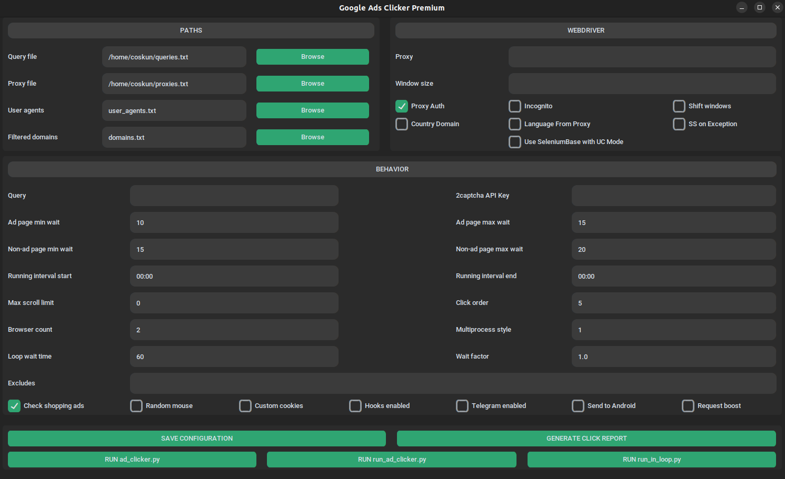
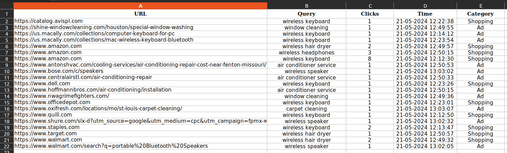
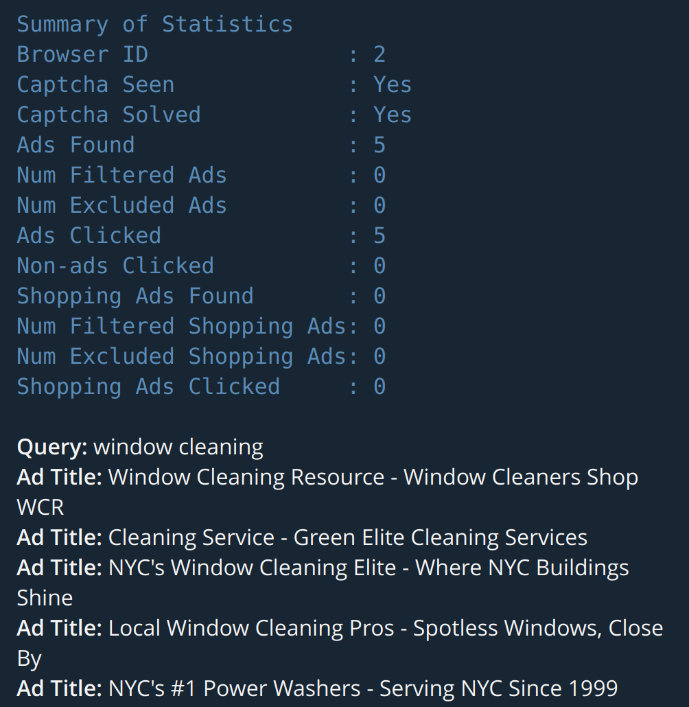
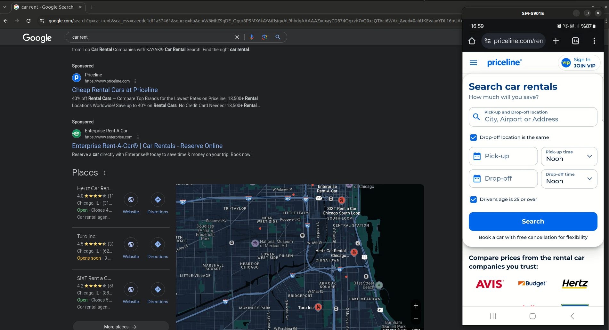

# Ad Clicker Premium for Google

This command-line tool clicks ads for a certain query on Google search using [undetected_chromedriver](https://github.com/ultrafunkamsterdam/undetected-chromedriver) or [SeleniumBase](https://github.com/seleniumbase/SeleniumBase) packages. Supports proxy, running multiple simultaneous browsers, ad targeting/exclusion, and running in loop.

### Features

* 🛠️ Single config file for all options
* 🖥️ Desktop UI for configuration and run
* 🗑️ Clear cache and cookies on browser exit
* 📄 External file for user agents
* 🖼️ Set browser window size
* 🎲 Shift browser windows by random offsets
* 🌍 Set opening URL based on the proxy country
* 🈵 Set browser language based on the proxy country
* 🖱️ Random scrolls and mouse movements on pages
* 🔗 Click non-ad links with domain filtering or in random
* 🔄 Custom click order between ad and non-ad links
* ⏱️ Set min/max waiting range for ad and non-ad pages
* 📜 Limit max scroll on the search results page
* 🍪 Use custom collected cookies
* ⏳ Set the running interval time
* 📊 Summary of statistics
* 🛍️ Click on the top shopping ads up to 5
* 🔐 2captcha integration
* 📨 Telegram notification
* 📝 Generate daily click report
* 📱 Open found links on Android device
* 🪝 Hooks for extending the tool with custom behavior
* 🚀 Request boost
* 💻 Remote control dashboard ([subscribe here](https://buy.stripe.com/00gdU8c3rg8KcUMdR7) - only for this feature) ([see how it works](https://vimeo.com/1072189164))

    

<br>

* Requires Python 3.9 to 3.11
* Requires the latest Chrome version

---
> Don't hesitate to give a ⭐ if you liked the project.

> See [Support](#support) section below for more options to support.
---


## How to setup

> ⚙️ If you want a ready to use [EXE for Windows](https://vimeo.com/1126408117), you can [buy it here](https://buy.stripe.com/3cI6oIg2I9HK3lZcpu4Ni0k). This will also help support the project.

---

* Run the following commands in the project directory to install the required packages.
    * `python -m venv env`
    * `source env/bin/activate`
    * `python -m pip install -r requirements.txt`

<br>

* To be able to use `pyautogui` for random mouse movements,
    * MacOS needs the `pyobjc-core` and `pyobjc` modules installed (in that order)

    * You must install tkinter on Linux.
        * `sudo apt install python3-tk python3-dev`

    * Windows does not have additional dependency.

<br>

See [here](https://github.com/coskundeniz/ad_clicker/wiki/Setup-for-Windows) for setup on Windows.


## How to run

* Please read all the config option explanations and FAQ section before starting.

* You need to see `(env)` at the beginning of your command prompt that is showing virtual environment is activated.

* Before running the below commands for the first time, run `python ad_clicker.py -q test` once and end it by pressing CTRL+C after seeing the browser opened.

* Run `python ad_clicker.py` for a single run with single browser.
* Run `python ad_clicker.py --smoke_test` for a safe browser/proxy smoke test that opens a neutral page and exits.
* Run `python ad_clicker.py --smoke_test --query "desentupidora porto alegre zn"` for a safe Google search smoke test that also saves a screenshot.
    * The smoke test uses Playwright with the local Chrome/Chromium binary and is intended for headless/server verification.
* Run `python run_ad_clicker.py` for a single run with multiple browsers.
* Run `python run_in_loop.py` for running in loop with either single or multiple browsers.
* Run `streamlit run streamlit_gui.py` for opening the web UI at `http://localhost:8501` and configure/run.

    

* Run `python ad_clicker.py --report_clicks` for generating click report.
* Run `python ad_clicker.py --report_clicks --date` for generating click report for the given date in DD-MM-YYYY format.
* Run `python ad_clicker.py --report_clicks --excel` for generating click report and writing results to an Excel file.

    * Example report
    

<br>

### Config Options

All options can be set in the `config.json` file in the project directory.

The followings are the default values in the config file.

```json
{
    "paths": {
        "query_file": "/home/coskun/queries.txt",
        "proxy_file": "/home/coskun/proxies.txt",
        "user_agents": "user_agents.txt",
        "filtered_domains": "domains.txt"
    },
    "webdriver": {
        "proxy": "",
        "auth": true,
        "incognito": false,
        "country_domain": false,
        "language_from_proxy": true,
        "ss_on_exception": false,
        "window_size": "",
        "shift_windows": false,
        "use_seleniumbase": false
    },
    "behavior": {
        "query": "",
        "ad_page_min_wait": 10,
        "ad_page_max_wait": 15,
        "nonad_page_min_wait": 15,
        "nonad_page_max_wait": 20,
        "max_scroll_limit": 0,
        "check_shopping_ads": true,
        "excludes": "",
        "random_mouse": false,
        "custom_cookies": false,
        "click_order": 5,
        "browser_count": 2,
        "multiprocess_style": 1,
        "loop_wait_time": 60,
        "wait_factor": 1.0,
        "running_interval_start": "00:00",
        "running_interval_end": "00:00",
        "2captcha_apikey": "",
        "hooks_enabled": false,
        "telegram_enabled": false,
        "send_to_android": false,
        "request_boost": false
    }
}
```

* **query_file**: File path to read queries to search. Used with `run_ad_clicker.py` and `run_in_loop.py`. Put a query for each line.

* **proxy_file**: File path to read proxies. Put a proxy for each line.

* **user_agents**: File path to read user agents. Default value is `user_agents.txt`.

* **filtered_domains**: File path to read domains to filter for clicking non-ad links. Default value is `domains.txt` in the project directory. If you don't want to filter non-ad domains, simply leave the `domains.txt` file empty and 3 links will be randomly selected.

* **proxy**: Use the given proxy with `ad_clicker.py`. The `proxy_file` and `proxy` parameters can not have a value at the same time.

* **auth**: Use proxy with username and password. If this is `true`, your proxies should be in `username:password@host:port` format

    > **Important Note:** Starting from Chrome 142, Google removed `--load-extension` argument that disables the ability to install
        plugins programmatically. Please make this parameter `false` and use your proxies in `IP:PORT` format with ip authentication
        method by whitelisting your IP on your proxy provider. Otherwise, you won't be able to use authenticated proxies.

* **incognito**: Run in incognito mode. Note that the proxy extension is not enabled in `incognito` mode.

* **country_domain**: Set opening URL based on the proxy country.

* **language_from_proxy**: Set browser locale language based on the proxy country.

* **ss_on_exception**: Enable taking screenshot in case of an exception.

* **window_size**: Set browser window size as `width,height` px.

* **shift_windows**: Shift browser windows by randomly selected x,y offsets.
    * If you are using a display zoom other than 100%, use this together with `window_size` option.
    * If a custom `window_size` is given, it is used to determine a new widthxheight for the window. Otherwise, screen resolution is used.

* **use_seleniumbase**: Use SeleniumBase with UC mode instead of undetected_chromedriver.

* **query**: Search query. The `query_file` and `query` parameters can not have a value at the same time.
    * A query like "wireless speaker@amazon#ebay  # mediamarkt" searches for "wireless speaker" and click links that include the given filter words in url or title.

    * Spaces around "@" and "#" are ignored, so both "wireless speaker@amazon#ebay" and
    "wireless speaker @ amazon  # ebay" take "wireless speaker" as search query and "amazon" and "ebay" as filter words.

    * If you will give a target domain as filter word, don't use "http" or "www" parts in it. Use like "query@domainname.com" or even "query@domainname". Keep it as short as possible to get a match.

* **ad_page_min_wait**: Number of minimum seconds to wait on the ad page. The value is randomly selected between the min/max ranges.
* **ad_page_max_wait**: Number of maximum seconds to wait on the ad page. The value is randomly selected between the min/max ranges.
* **nonad_page_min_wait**: Number of minimum seconds to wait on the non-ad page. The value is randomly selected between the min/max ranges.
* **nonad_page_max_wait**: Number of maximum seconds to wait on the non-ad page. The value is randomly selected between the min/max ranges.

* **max_scroll_limit**: Number of maximum scrolls on the search results page. It will scroll until the end of the page by default(0).

* **check_shopping_ads**: Enable checking and clicking shopping ads seen on top up to 5 if exists. It is more likely to see shopping ads if you use residential proxies.

* **excludes**: Exclude the ads that contain given words in url or title.
    * A value like "amazon.com,mediamarkt.com,for 2022,Soundbar" click links except the ones containing the given words in url or title.
    * Separate multiple exclude items with comma.

* **random_mouse**: Enable random mouse movements on pages.

* **custom_cookies**: Use custom collected cookies. They should be put into `cookies.txt` file in the project directory.

* **click_order**: Click order for ad and non-ad links found
    * 1: click all non-ad links first, then click ad links
    * 2: click all ad links first, then non-ad links
    * 3: click 1 non-ad, then 1 ad, then all remaining non-ads, finally all remaining ads
    * 4: click 1 non-ad, then 1 ad on each round
    * 5: shuffle ad and non-ad links and click whichever order is created (default)

* **browser_count**: Maximum number of browsers to run concurrently. Used with `run_ad_clicker.py` and `run_in_loop.py`.
    * If the value is 0, the number of cpu cores is used.

* **multiprocess_style**: Style of the multiprocess run. Used with `run_ad_clicker.py` and `run_in_loop.py`.
    * 1: different query on each browser (default)
        * e.g. First, queries in the file are shuffled. Then, 5 browsers search the first 5 queries from the file.
    * 2: same query on each browser
        * e.g. 5 browsers search the first query from file. After they are completed, second group of 5 browsers search the second query and so on.

    * If the number of queries or proxies are less than the number of browsers to run, they are cycled.
    * If *multiprocess_style* is 1, queries read from the file are shuffled.

* **loop_wait_time**: Wait time between runs in seconds. Default is 60. Used with `run_in_loop.py`.

* **wait_factor**: Wait factor to modify all sleeps except loop wait. The default value is 1.0.
    * For example, if you want to decrease waits by half, you can set this to 0.5, or if you want to increase them by 30%, you can use this as 1.3.
    * Note that especially with decreasing, it can make the tool faster but can not guarantee proper functioning.

* **running_interval_start**: Running interval start in "HH:MM" format. Used with `run_in_loop.py`.
    * If the current time is outside of the interval, it waits the start time to run again.
* **running_interval_end**: Running interval end in "HH:MM" format. Used with `run_in_loop.py`.
    * Difference between start and end time must be at least 10 minutes.
    * If both start and end is "00:00"(default), no interval check is done.

* **2captcha_apikey**: API key for 2captcha service.
    * Note that this is a 3rd party service, so you need to [register with it](https://2captcha.com/?from=18906047) to get an API key.

* **hooks_enabled**: Enable hooks for extending the tool with custom behavior.
    * You can implement the functions in the `hooks.py` module as your need.
    * Any errors coming from your custom implementation will be in your responsibility.
    * Installing additional 3rd-party packages used in your implementation is in your responsibility.

* **telegram_enabled**: Enable Telegram notifications.
    * You will get a message like below.

        

    * There is a limit of 2048 characters. If the length of the message exceeds this, it will be truncated.

* **send_to_android**: Send links to open on connected Android mobile device. Used with `run_ad_clicker.py` and `run_in_loop.py`.

    * Note that mobile device must be connected to the same wireless network or directly via USB cable for one of these usages.

    * If you have less devices(n) than browsers you run, first n browsers will be assigned to n devices.

    * ADB setup steps
        1. Open your phone’s **Settings**.
        2. Scroll down to **About phone**.
        3. Find **Build number** (usually under Software Information).
        4. Tap Build number 7 times. You should see a message like "You are now a developer!"
        5. Go back to Settings, and you will now see a **Developer options** menu.
        6. Open **Developer options** and enable **USB Debugging**.

        7. Install ADB on your computer
            * `sudo apt install adb`

            * See [here](https://www.xda-developers.com/install-adb-windows-macos-linux/) or [here](https://www.howtogeek.com/125769/how-to-install-and-use-abd-the-android-debug-bridge-utility/) for Windows.

        8. Verify installation
            * `adb version`

        9. Connect your phone to your computer via USB.
            * When prompted on your device, select Allow USB Debugging.

        10. Check if ADB recognizes your device by running `adb devices`.
            * If you see your device’s ID, the connection is successful.

    * You can also use ADB wirelessly without a USB cable.

        1. Connect your phone to your computer via USB and enable USB Debugging as explained before.
        2. Run the following command.
            * `adb tcpip 5555`

        3. Disconnect the USB cable and find the phone’s IP address (Settings > About phone > Status).
        4. Connect ADB to your phone wirelessly.
            * `adb connect <phone_ip>:5555`

    * Watch an example run

        [](https://vimeo.com/1072189351)

* **request_boost**: Send 10 parallel requests to the link clicked with different IPs in addition to the browser click.

    * Note that this can cause bans due to number of requests sent in a short period.

<br>

### Enable Telegram Notification

Apply the following steps for once to enable Telegram notifications.

1. Create your own Telegram bot using the [BotFather](https://t.me/BotFather).
2. Set `TELEGRAM_TOKEN` environment variable with your own token received from the BotFather. You can see the instructions to set environment variables [here for Linux](https://phoenixnap.com/kb/linux-set-environment-variable), [here for Windows](https://phoenixnap.com/kb/windows-set-environment-variable), and [here for Mac](https://phoenixnap.com/kb/set-environment-variable-mac).
3. Run `python ad_clicker.py --enable_telegram`
4. Open [https://t.me/<your_bot_name>]()
5. Send `/start` command.
6. End script by pressing CTRL+C.

<br>

## Execution Example

[Watch recording of an execution](https://vimeo.com/1072188364)

<br>

## FAQ

<details>
  <summary><b>Which are the supported platforms?</b></summary>
    You can run the tool on Linux(recommended) and Windows.
</details>

<details>
  <summary><b>Does it have a UI?</b></summary>
    Yes, it has a desktop ui. This is a command-line tool but it just requires a simple command to start. All options can be set in a config file easily.
</details>

<details>
  <summary><b>What kind of proxies are supported?</b></summary>
    It supports IPv4 http proxies.
</details>

<details>
  <summary><b>How many browsers can I run simultaneously?</b></summary>
    It depends on your configuration and system properties. You can run as much as your number of cpu cores. I recommend (cpu core - 1) as maximum.
</details>

<details>
  <summary><b>How many clicks does it make per minute/hour?</b></summary>
    It depends on your configuration.
</details>

<details>
  <summary><b>Can I send hundreds of clicks in a few minutes?</b></summary>
    No, you can't. The goal of the tool is to become as close as possible to human behavior.
</details>

<details>
  <summary><b>What happens if there is captcha shown?</b></summary>
    The tool has 2captcha integration. If you register for a 2captcha account, captcha is solved using it.
</details>

<details>
  <summary><b>What should I do if I need customization or support?</b></summary>
    Please see the support section below.
</details>

<br>

## Troubleshooting

#### 1. ValueError: max() arg is an empty sequence

* If you see this error, run the following commands.

    1. Delete `.MULTI_BROWSERS_IN_USE` file if exists.
        * `rm .MULTI_BROWSERS_IN_USE` for Linux or `del .MULTI_BROWSERS_IN_USE` for Windows.

    2. Run `python ad_clicker.py -q test` and end it by pressing CTRL+C after seeing the browser opened.

    3. Continue with one of the commands from [How to run](#how-to-run) section.

#### 2. Chrome version mismatch error

* If you get an error like **"This version of ChromeDriver only supports Chrome version ... Current browser version is ..."**, it means you are using an older Chrome version and should update to the latest one.

* You may need to apply [solution from the previous section](#1-valueerror-max-arg-is-an-empty-sequence) for some cases.

<br>

## Support

[https://coskundeniz.github.io/ad_clicker](https://coskundeniz.github.io/ad_clicker)

If you benefit from this tool, please give a star and consider donating using the sponsor links([patreon](https://patreon.com/ritimdarbuka), [ko-fi](https://ko-fi.com/coskundeniz)) or the following crypto addresses.

* ETH: 0x461c1B3bd9c3E2d949C56670C088465Bf3457F4B
* USDT: 0x1a4f06937100Dc704031386667D731Bea0670aaf

---

* Support project by buying it once [here](https://buy.stripe.com/4gw6rGffD3lYdYQ4gu).

* Support project by monthly subscription($10/month) [here](https://buy.stripe.com/aFa9AU5o44nq6yb9di4Ni0i).
